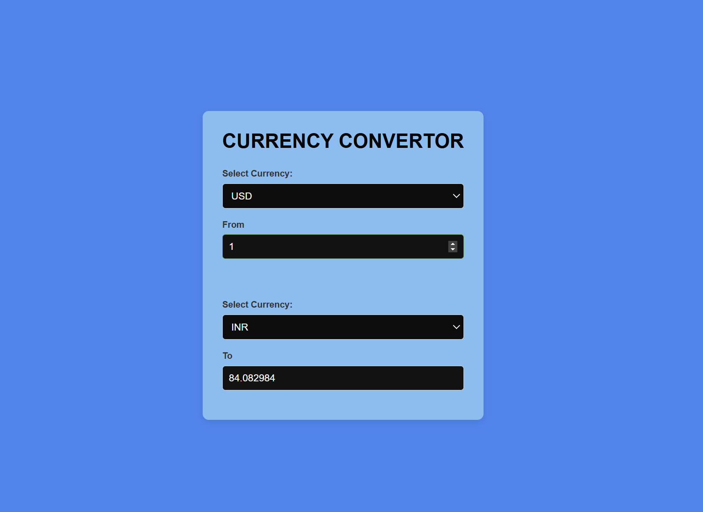

# Currency Converter

A web-based currency converter tool that allows users to convert between different currencies using live exchange rates. The tool includes easy-to-use dropdowns for selecting currencies and input fields to enter the amount to be converted.

## Features
- **Real-time currency conversion**: Uses up-to-date exchange rates for accurate conversions.
- **Responsive design**: The UI adjusts for desktop and mobile devices.
- **Clean and modern UI**: Styled with CSS for a professional appearance.

## Technologies Used
- **React**: JavaScript library for building the user interface.
- **CSS**: For styling components and layout.

